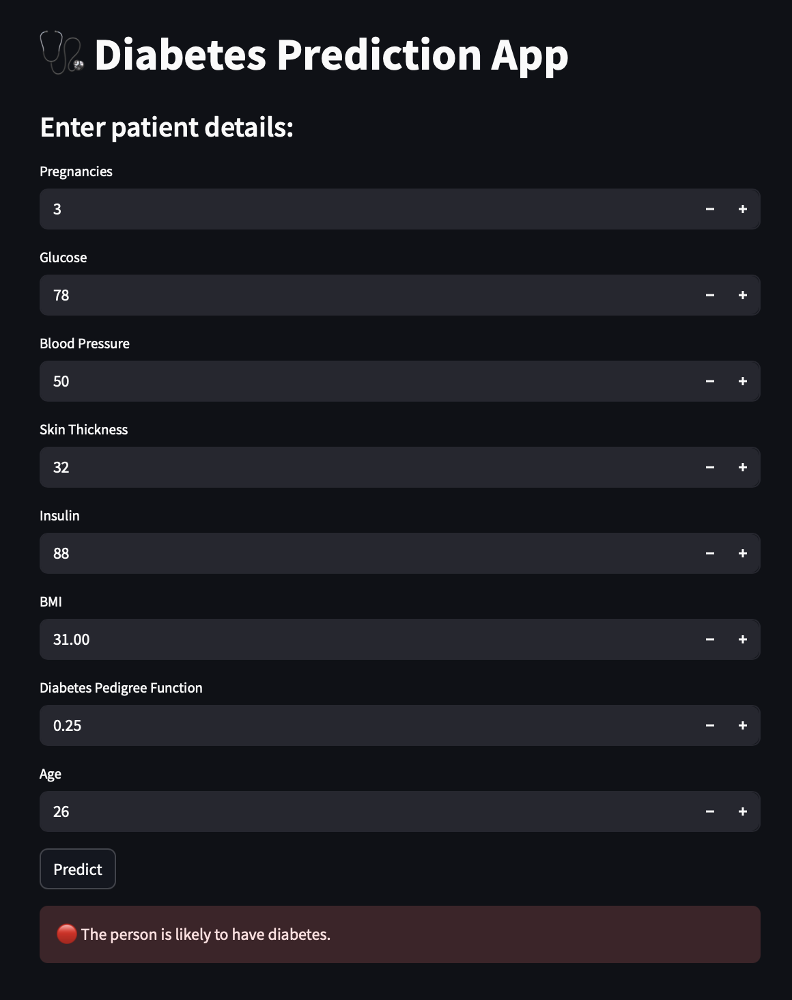

# Diabetes Prediction

A comprehensive machine learning project for predicting diabetes using medical datasets. This repository provides source code, data, models, and documentation to help you understand, develop, and deploy a diabetes prediction system.

---

## Project Overview

This project uses machine learning algorithms to predict whether a patient is likely to have diabetes based on diagnostic measurements. The goal is to assist healthcare professionals in early diagnosis and intervention using data-driven techniques.

---

## Demo



---

## Features

- Data preprocessing and cleaning
- Exploratory Data Analysis (EDA) with visualizations
- Feature engineering and selection
- Multiple machine learning models (Logistic Regression, Random Forest, SVM, etc.)
- Model evaluation using various metrics (accuracy, precision, recall, F1-score, ROC-AUC)
- Comparison of model performances
- Option to run as a Python script or Jupyter Notebook
- (Optional) Web app deployment (Flask/Streamlit)

---

## Tech Stack

- **Languages:** Python
- **Libraries:** scikit-learn, pandas, numpy, matplotlib, seaborn
- **Deployment:** Streamlit

---

## Installation

1. **Clone the repository**

   ```bash
   git clone https://github.com/harshil748/diabetes-predection.git
   cd diabetes-predection
   ```

2. **(Optional) Create a virtual environment**

   ```bash
   python -m venv venv
   source venv/bin/activate  # On Windows: venv\Scripts\activate
   ```

3. **Install dependencies**

   ```bash
   pip install -r requirements.txt
   ```

---

## Usage

Run the main script:

```bash
python main.py
```

Or open the Jupyter notebook:

```bash
jupyter notebook diabetes_prediction.ipynb
```

If a web interface is available:

```bash
streamlit run app.py
# or
flask run
```

---

## Dataset

- **Source:** [Pima Indians Diabetes Database - Kaggle](https://www.kaggle.com/uciml/pima-indians-diabetes-database)
- **Features:**
  - Pregnancies
  - Glucose
  - Blood Pressure
  - Skin Thickness
  - Insulin
  - BMI
  - Diabetes Pedigree Function
  - Age
  - Outcome (0 or 1)

---

## Model Details

- **Preprocessing:** Handling missing values, normalization, feature selection
- **Algorithms:** Logistic Regression, Random Forest, SVM, and more
- **Evaluation:** Accuracy, Precision, Recall, F1-score, ROC-AUC

---

## Results

| Model               | Accuracy | Precision | Recall | F1-Score |
| ------------------- | -------- | --------- | ------ | -------- |
| Logistic Regression | 0.78     | 0.75      | 0.72   | 0.73     |
| Random Forest       | 0.82     | 0.80      | 0.78   | 0.79     |
| SVM                 | 0.79     | 0.76      | 0.74   | 0.75     |

---

## Contributing

Contributions are welcome!  
Please follow these steps:

1. Fork the repository
2. Create a new branch (`git checkout -b feature/your-feature`)
3. Commit your changes (`git commit -am 'Add new feature'`)
4. Push to your branch (`git push origin feature/your-feature`)
5. Open a Pull Request

---

## License

This project is licensed under the [MIT License](LICENSE).

---

## Author

### Harshil748

- [GitHub](https://github.com/harshil748)

---

**Feel free to enhance this README with more details specific to your implementation, results, or deployment. If you add a web app, API, or extra scripts, update the relevant sections accordingly!**

---
